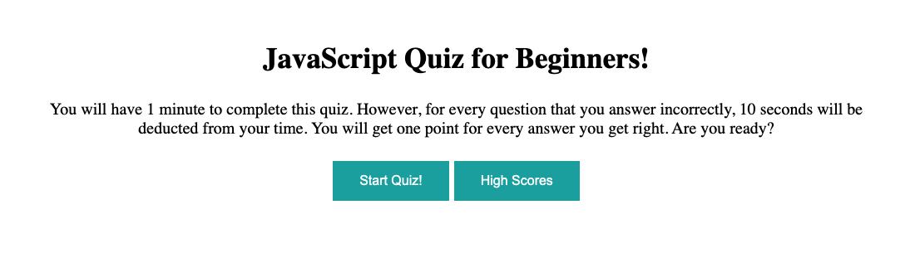
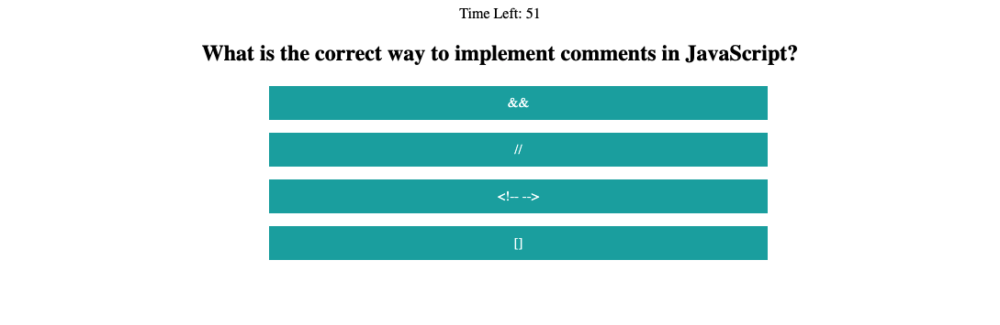
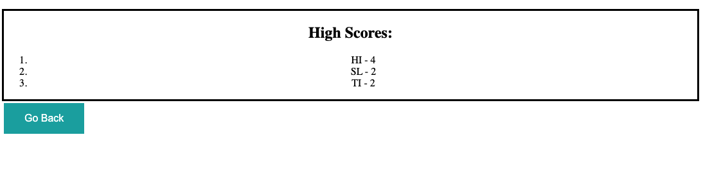

# JavaScript Quiz for Beginners

## Description
This application tests users on beginner level JavaScript concepts. Users will have one minute to complete the quiz. If they answer the question incorrectly, ten seconds will be deducted from the timer. The users score is equivalent to the amount of questions they get correct. Users can also see where they rank among other players through the high scores list. 

## Built With
* HTML
* CSS
* JavaScript

## Screenshots

## Website
https://stevenmly.github.io/code-quiz/

## Contribution
Made with ❤️ by Steven Ly